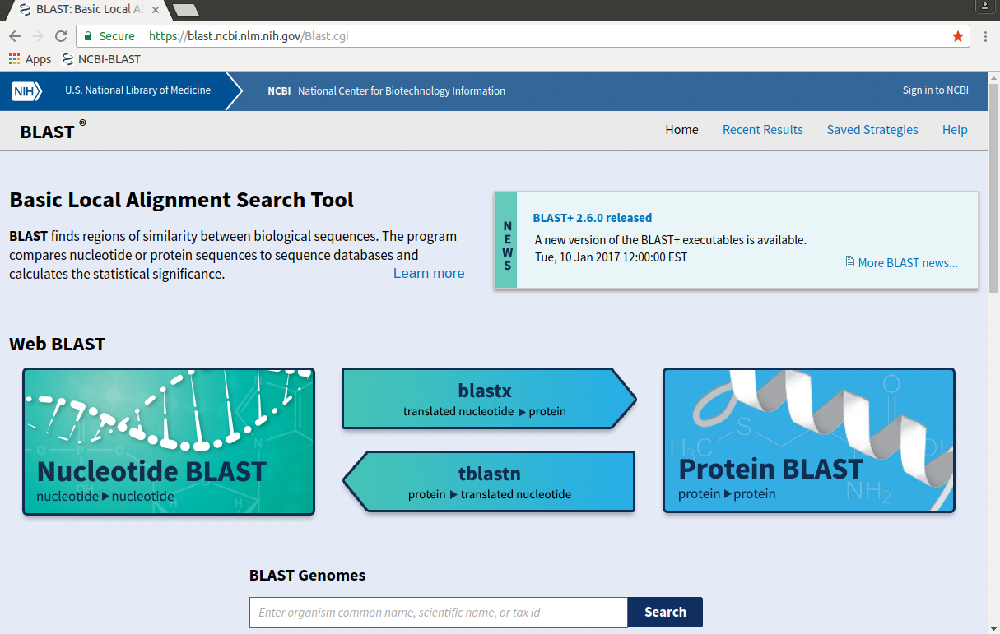
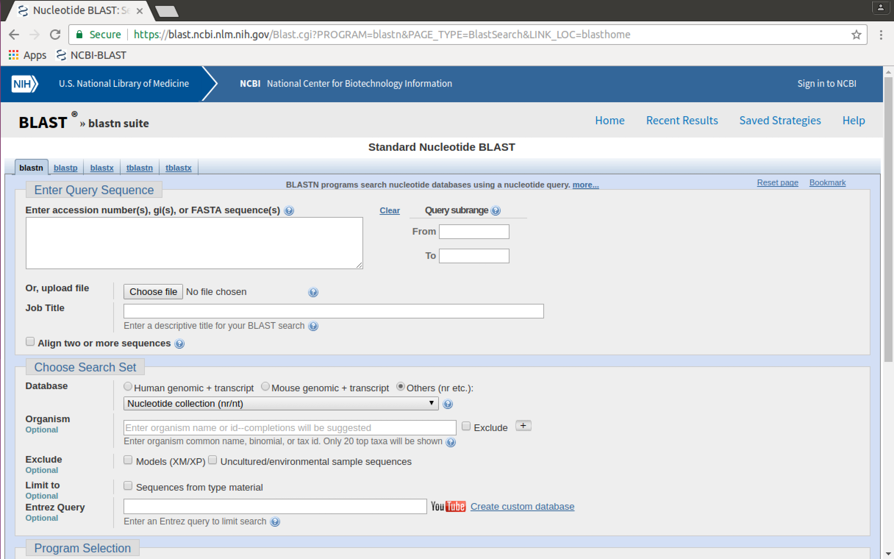
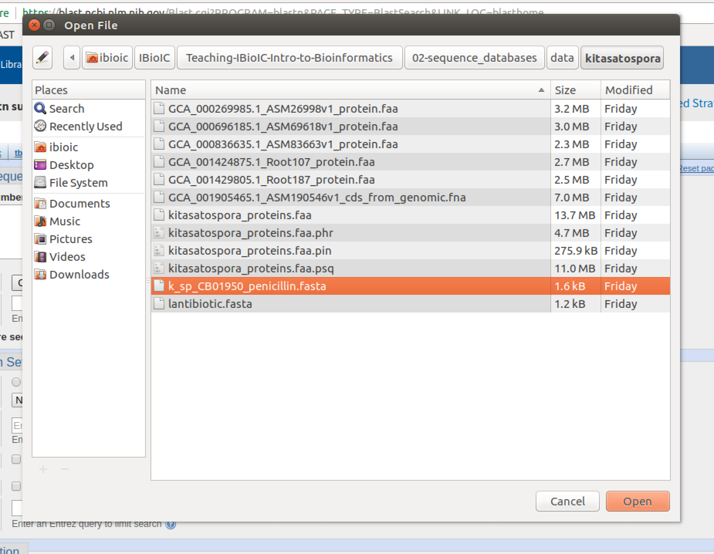
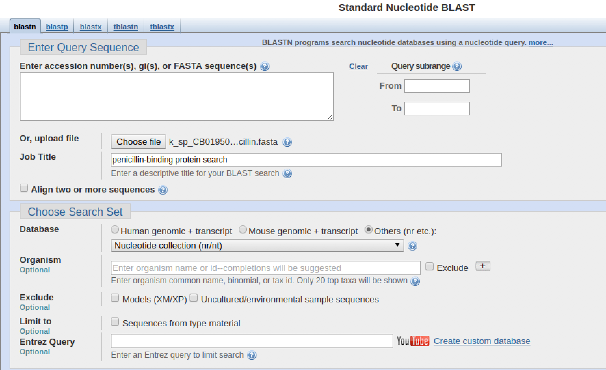
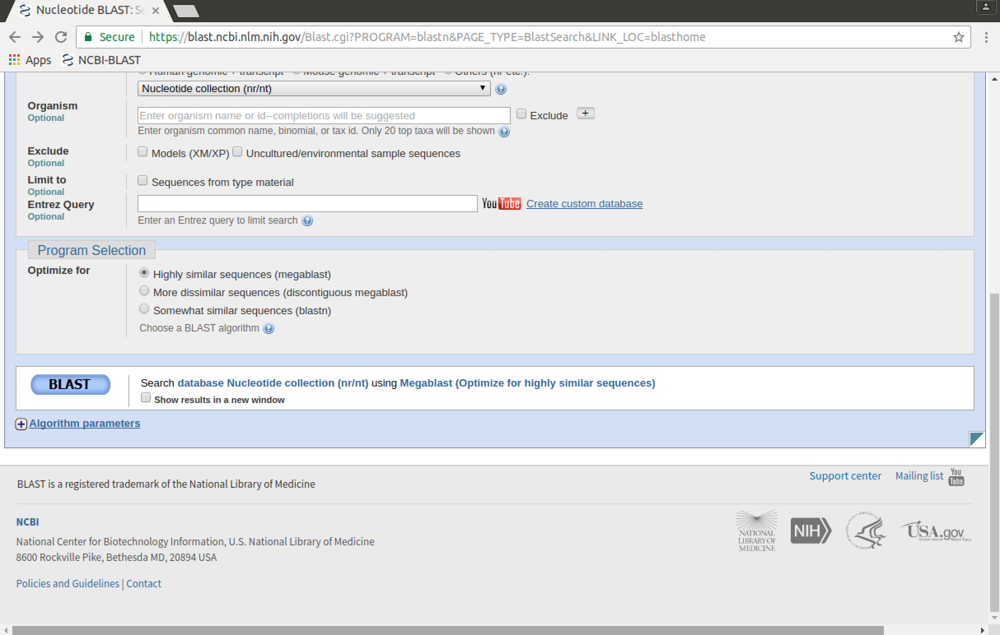
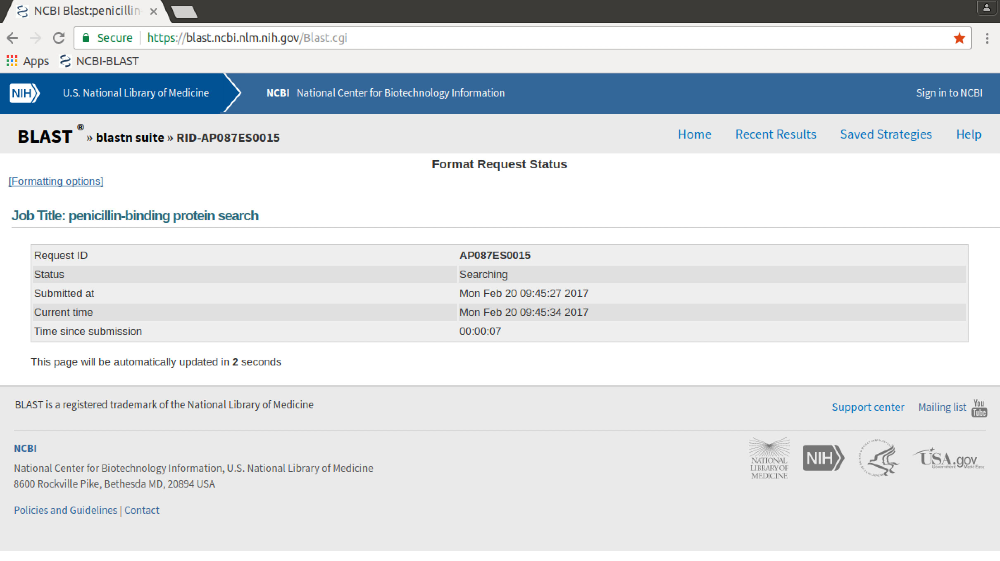
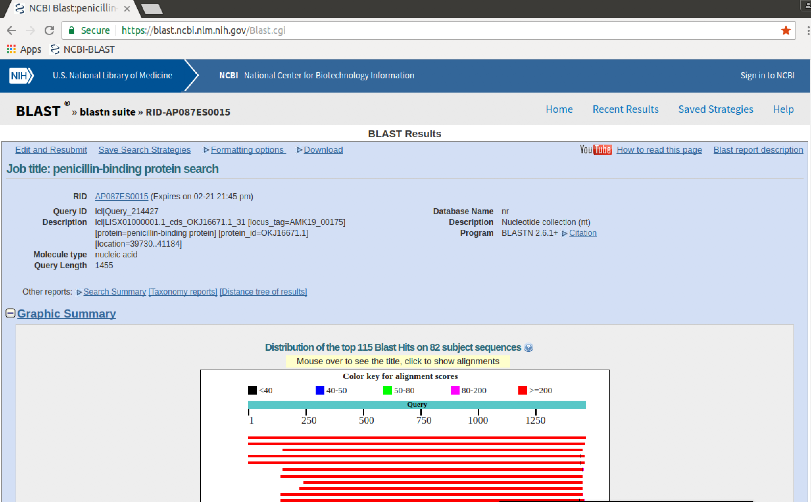

# 01-`BLAST+` at NCBI

## Introduction

The `BLAST/BLAST+` package compares nucleotide or protein sequences to other databases of biological sequences, and reports back what it considers to be the most similar sequences from the database.

`BLAST` can be run using any of several interfaces, including:

* at the NCBI website: [https://blast.ncbi.nlm.nih.gov/Blast.cgi](https://blast.ncbi.nlm.nih.gov/Blast.cgi)
* using the `ncbi-blast` program suite in a terminal
* by interacting with the tool, using a programming language
* creating a new *instance* in the cloud, to run your own `BLAST` server

In this part of the course, we will use the first three methods to explore ways of using `BLAST`. In this markdown notebook, we will use `BLAST` at the NCBI website, but in the next two notebooks we will use a local installation of `BLAST` on a Linux virtual machine (VM).

### Why so many ways to use `BLAST`?

Each of the interfaces has advantages and disadvantages that should help you decide when and why to use any particular approach.

* The web interface at NCBI is user-friendly, and available wherever you have a network connection. It uses the large computing resources of NCBI to run queries against very large databases very quickly. A number of variants to the standard `BLAST` search are offered, which may be appropriate for a particular task, but you can't use your own custom databases
* Using a local installation of `ncbi-blast` at the terminal gives you full control over how to use the program, and allows you to build custom databases (useful for proprietary information). However, you are limited to the computing power you have available. Happily, `BLAST` doesn't require excessive amounts of computing resources and for many tasks a desktop or laptop machine is sufficient.
* Programmatic running of `BLAST` - either locally or using the web interface to the NCBI servers - allows for repeated searches, and automated integration of the search results with arbitrary data-processing tasks and other analyses.

### Resources

* [NCBI `BLAST` webpage](https://blast.ncbi.nlm.nih.gov/Blast.cgi)
* [`ncbi-blast+` download](https://blast.ncbi.nlm.nih.gov/Blast.cgi?PAGE_TYPE=BlastDocs&DOC_TYPE=Download)
* [Original publication: Altschul *et al.* (1990)](http://dx.doi.org/10.1016/S0022-2836(05)80360-2)
* [Gapped `BLAST` publication: Altschul *et al.* (1997)](https://www.ncbi.nlm.nih.gov/pmc/articles/PMC146917/)

## Using the NCBI website

* Open Google Chrome and navigate to the [NCBI `BLAST` webpage](https://blast.ncbi.nlm.nih.gov/Blast.cgi). You can use the NCBI-BLAST bookmark for this.

Scrolling up-and-down the page indicates several available `BLAST` tools, including:

  * 'Nucleotide BLAST' (`BLASTN` - query a nucleotide sequence against a database of nucleotide sequences)
  * 'Protein BLAST' (`BLASTP` - query a protein sequence against a database of protein sequences)
  * `BLASTX` (query a nucleotide sequence against a database of protein sequences)
  * `TBLASTN` (query a protein sequence against a database of nucleotide sequences)
  * SmartBLAST (query a protein against the specialised "landmark" database to find highly-similar sequences)
  * Primer-BLAST (find primers specific to your PCR template)
  * CD-search (search specifically for conserved domains of a sequence)
  * GEO (query a nucleotide sequence against a database of transcriptional expression profiles)
  * Targeted Loci (query a nucleotide sequence against a database of sequence markers)
  
These tools are applications of the generic `BLAST` tools using custom search parameters and/or custom databases against which to search with the input sequence. You could, with some effort, reproduce all these different tools yourself with the information in this course.

* Click on the "Nucleotide BLAST" link to get the web `BLASTN` interface.

Sequences can be typed or copied and pasted into the "Enter Query Sequence" box, but they can also be uploaded from an existing FASTA file on your computer. We will do this.

* Click on the "Choose file" button. A file dialogue will pop up.
* In the file dialogue, navigate to, and select the file `k_sp_CB01950_penicillin.fasta` in the `02-sequence_databases/data/kitasatospora` directory. Then click on "Open".

The file will show up as being selected next to the "Choose file" button.

* Enter a descriptive job title in the **Job Title** field
* Make sure the selected database is "Nucleotide collection"

* Scroll to the bottom of the page and click on the "BLAST" button.

An interstitial page will appear, reporting the job ID, and giving you runtime information. The page will be updated automatically, and frequently.

Once the job is complete, the results will be displayed as an interactive webpage.

* Inspect the results - note the information that the page gives you about how the search was done.

### QUESTIONS

1. What is the "best hit" to the query? Why do you think it is the "best hit" (what in the results tells you this?)
2. At what point do you think the matches start to become less reliable? Why do you think this? (*HINT:* inspect the alignments)
3. Click on the links to `[Taxonomy reports]` and `[Distance tree of results]` at the top of the page. What information do these reports add to the main result?

### Download the results

* Click on the `Download` link at the top of the results page.

* Right-click on the download link for `Text` and save the results to `output/kitasatospora/ncbi_blastn_query_01.txt`
* Right-lick on the download link for `Table(CSV)` and save the results to `output/kitasatospora/ncbi_blastn_query_01.csv`

We will use these outputs in later exercises.

## Exercise 01: Using the NCBI `BLAST` Website

Using the NCBI `BLAST` website:

* Conduct a `BLASTX` query with `data/kitastaospora/lantibiotic.fasta` against the `nr` database, restricting your results only to *Kitasatospora* spp. matches (taxid: 2063)
* Save the results in `Text` and `Table(CSV)` format to `output/kitasatospora/ncbi_blastx_query_02.txt` and `output/kitasatospora/ncbi_blastx_query_02.csv`

### QUESTIONS

1. How many hits do you find?
2. What is the "best hit" to the query? Why do you think it is the "best hit" (what in the results tells you this?)
3. At what point do you think the matches start to become less reliable? Why do you think this? (*HINT:* inspect the alignments)