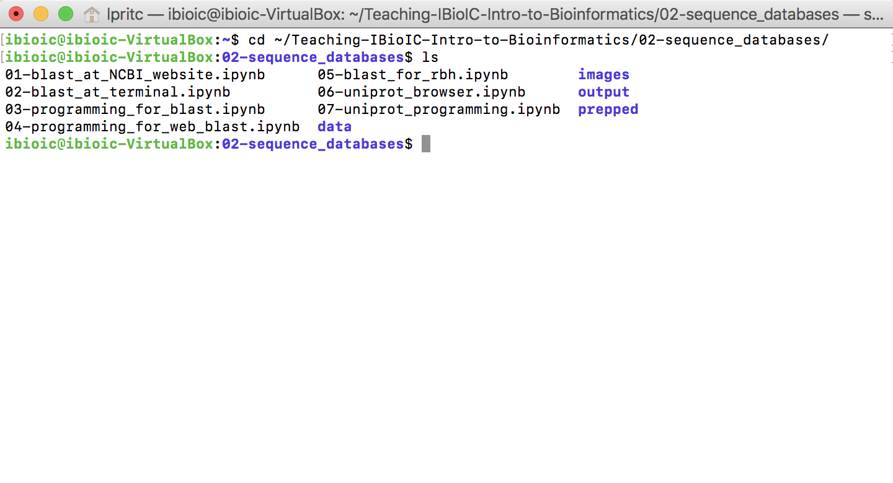
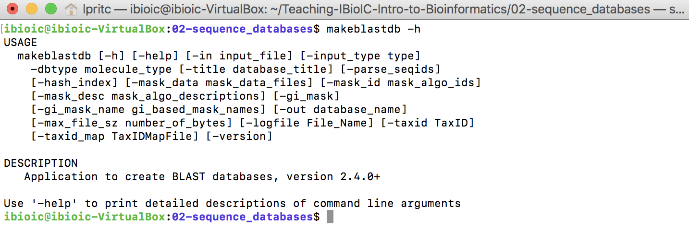

# 02-`BLAST+` at the terminal

## Introduction

The `BLAST/BLAST+` package can be installed on your own machine (desktop or laptop) or on a shared server. This gives you full control over how to use the program, and allows you to build custom databases (useful for proprietary information). However, you are limited to the computing power you have available. Happily, `BLAST` doesn't require excessive amounts of computing resources and for many tasks a desktop or laptop machine is sufficient.

### Resources

* [`ncbi-blast+` download](https://blast.ncbi.nlm.nih.gov/Blast.cgi?PAGE_TYPE=BlastDocs&DOC_TYPE=Download)
* [Original publication: Altschul *et al.* (1990)](http://dx.doi.org/10.1016/S0022-2836(05)80360-2)
* [Gapped `BLAST` publication: Altschul *et al.* (1997)](https://www.ncbi.nlm.nih.gov/pmc/articles/PMC146917/)

## Using `BLAST+` in the terminal

* If necessary, open a terminal window in the virtual machine (VM)


* Change directory to the `~IBioIC/Teaching-IBioIC-Intro-to-Bioinformatics/02-sequence_databases` lesson directory:

```
cd IBioIC/Teaching-IBioIC-Intro-to-Bioinformatics/02-sequence-databases
ls
```



* Establish that `BLASTN` works by issuing a command to get the short help message:

```
blastn -h
```


### Build a `BLAST+` database

The program that builds `BLAST+` sequence databases is `makeblastdb`. You can get basic help on the command by issuing:

```
makeblastdb -h
```


To build a `BLAST` database we need to provide the following information:

1. A file containing the sequences that will be in the database
2. What kind of sequence (nucleotide or protein) data the file contains
3. A name for the database (optional)
4. A path to write the database files to (optional)

* Create a new `BLAST` database with the following command:

```
makeblastdb -in data/kitasatospora/GCA_001905465.1_ASM190546v1_cds_from_genomic.fna \
            -dbtype nucl \
            -title kitasatospora_cds \
            -out data/kitasatospora/kitasatospora_cds
```

This will return some information to the terminal, and create the database.


This creates three files, which together comprise a new `BLAST` nucleotide database against which you can make queries.


## Exercise 01: Get `BLAST` help at the Terminal
1. Use the following command to get the long-format help messages for `BLASTN` and `BLASTX`: `blastn -help` and `blastx -help`. Pay particular attention to the options for output `-outfmt` and `-out`, and the options that control the general search options.

### Construct a `BLASTN` query

After looking at the help information in the exercise above, you will have seen that there are several input relevant input options:

* `-query`: path to the query sequence(s)
* `-db`: path to the `BLAST` database
* `-outfmt`: the output format you want `BLAST` to produce
* `-o`: path to the output file you want `BLAST` to write

Building a `BLAST` query at the command-line/terminal is a matter of using the appropriate program (here `blastn`) and passing it the input options you need to use.

In this case, your query sequence is `data/kitasatospora/lantibiotic.fasta`, the database you're searching against is the one you created above: `data/kitasatospora/kitasatospora_cds`, and we'll generate output in two formats (the same ones that we produced from the NCBI website search). We will need to construct two commands, each with the same query and database, but different output format values, and output filenames:

* no format specified, filename: `output/kitasatospora/terminal_blastn_query_01.txt`
* format: `6` (tabular), filename: `output/kitasatospora/terminal_blastn_query_01.tab`

* Run the first command at the terminal:

```
blastn -query data/kitasatospora/lantibiotic.fasta \
       -db data/kitasatospora/kitasatospora_cds \
       -out output/kitasatospora/terminal_blastn_query_01.txt
```

The command will run without producing any output on the screen, but you can see the first few lines of the output by issuing:

```
head -n 40 output/kitasatospora/terminal_blastn_query_01.txt
```

* Run the second command, now specifying a different (tabular) output format:

```
blastn -query data/kitasatospora/lantibiotic.fasta \
       -db data/kitasatospora/kitasatospora_cds \
       -outfmt 6 \
       -out output/kitasatospora/terminal_blastn_query_01.tab
```

You can inspect the contents of this file by issuing the command:

```
less output/kitasatospora/terminal_blastn_query_01.tab
```

#### QUESTIONS

1. How many hits were found
2. How large was the database?
3. How does the tabular output compare to the plain text output?


## Exercise 02: Using `BLAST` at the Terminal

Using `BLAST` in the terminal:

* Conduct a `BLASTX` query with `data/kitastaospora/lantibiotic.fasta` against the `data/kitasatospora/kitasatospora_proteins.faa` database, writing results in `Text` and `Table(CSV)` format to 
  * `output/kitasatospora/terminal_blastx_query_02.txt`
  * `output/kitasatospora/terminal_blastx_query_02.csv`

#### QUESTIONS

1. How many hits do you find?
2. What is the "best hit" to the query? Why do you think it is the "best hit" (what in the results tells you this?)
3. At what point do you think the matches start to become less reliable? Why do you think this? (*HINT:* inspect the alignments)