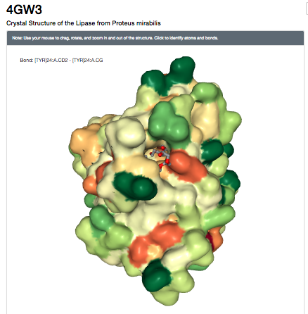
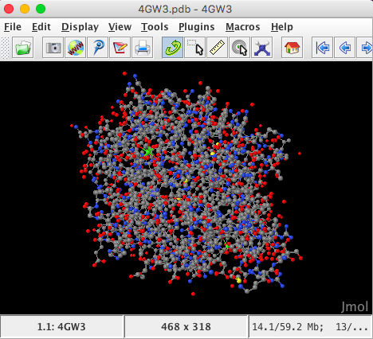
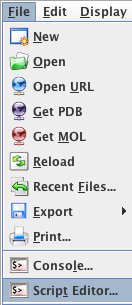
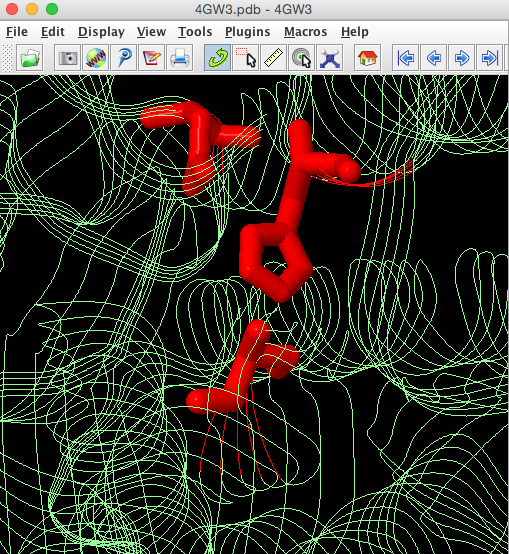
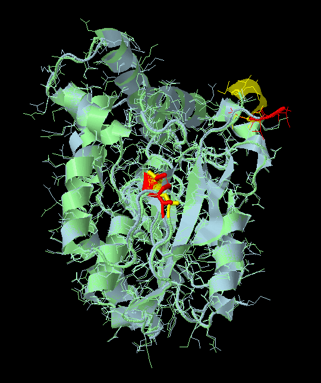

## 03-Protein structure visualization and analysis practical
### Introduction
So far all our analyses have been based on gene sequences and the protein sequences they encode. Proteins have a secondary and tertiary structure (and some also have a quarternary structure). Information about protein structures are stored in the RCSB (also known as the PDB) and it comprises >127K biological structures, of which 123K are proteins.

### 03-01 Exploring the RSCB for PML structures
We will use the RCSB to search for the structures of PMLs and explore  their 3D structures. Its is possible to search the RCSB in a number of ways, including by PBDcode ID, keywords (not recommended) and sequence similarity.

From the previous session on PML sequences it is possible to find the PDB code ID for the WT PML is 4GW3 (there were cross references to the RCSB from the [Uniprot entry: B4EVM3_PROMH](http://www.uniprot.org/uniprot/B4EVM3)


####03-01-01 Searching the RCSB
Use the search box at the top of the [RCSB homepage](http://www.rcsb.org/) to search for entry 4GW3.


This shows the "Structure Summary" page for [4GW3](http://www.rcsb.org/pdb/explore/explore.do?structureId=4gw3)

![PDB 4GW3 entry] (images/PDB-4GW3.png)

Note the different tabs at the top of the entry which give access to difference types of information about the 4GW3 structure.

Using the expanded Macromolecules section of the Structure Summary page, 

![PDB 4GW3 Domain] (images/expand-domain-view.png)

we see that this structure has one sequence domain and we will come back to view this domain on the structure later.

![PDB 4GW3 Domain] (images/RCSB-4GW3-domain2.png)


#####Exercise 1: [10 mins] Browse the RCSB 4GW3 entry and answer the following questions
#####Answer the following questions: 

1. What method has been used to solve the structure of 4GW3 and is the "quality" of the structure suitable for analysis of its molecular structure?
2. What ligands does this PML structure have bound?
3. How many amino residues does this PML structure have?
4. What is the protein stoichiometry of 4GW3?
5. Which Pfam domain is present in this protein and what residues does it span?
5. How many other proteins in the PDB share 40% sequence similarity with 4GW3 and do you think that these structures all have the same structure and function?


####03-01-02 PM Lipases in the RCSB database
Using the sequence similarity tab to view the sequence similarity clusters of 4GW3. This shows that there are 4 structures that have 95% sequence identity. 


| RCSB Code  | Structure Description | 
|:------------- |:--------------- 
| 4GW3      	| PML- wild type (WT)   
| 4GXN     	| PML -WT Diethylphosphonate Inhibited                  
|4HS9			| PML Methonal tolerant mutant      
|3W9u 			| PM Lipk107         

We will concentrate on the first 3 structures, as the 4th is poorly annotated and does not have a publication associated with the RCSB entry. Hence it is more uncertain what this structure actually is.


### 03-02 Visualization of PML structures using a web-based tool (NGL)
RCSB uses a number of web-based applications (e.g. JSmol and NGL) to allow visualization of protein structures directly from their webpages. 

Click on the [3D View tab]( http://www.rcsb.org/pdb/explore/jmol.do?structureId=4GW3&bionumber=1) at the top of the 4GW3 entry to view the structure. By default it loads the JSmol application, but use the selection box below the structure to use NGL.
 

 
 This will load 4GW3 showing the secondary structure. 
 
 

You can use the Diplay and View Options to alter how the protein and its ligands are depicted. The colour scheme options can be used to display the surface of the protein in different ways E.g. Colour by hydrophobicity (hydrophobic residues do not like to reside in an aqueous environment).




If there are ligands or ions in the structure you can use the Interaction option to zoom in and display the binding pockets and amino acids involved in the interactions. E.g Binding pocket for PA


#####Exercise 2: [10mins]
Use the Display and Viewer Options on the right hand side to 

1. colour 4GW3 by secondary structure 
2. show the position of calcium ions in 4GW3
3. view the surface of the protein and colour by hydrophocity
4. view the surface of the protein and colour by b-factor

#####Answer the following questions: 

1. What fold does 4GW3 have? Search the [CATH database](http://www.cathdb.info/) to help you answer this.
2. What amino acids residues are involved in binding Calcium ion CA 401?
3. What does the hydrophobicty colour scheme show you about the binding pocket where ligands PE and PA occur?
4. Each atom of protein crystal structure can have a B-factor (also known as the temperature or Debye-Waller factor ) associated with it. This essentially describes the degree to which the electron desnity is spread out. When you colour the protein surface by this factor what do you think it shows you? 

### 03-03 Visualizing PML structure in Jmol using scripting
So far we have used the web based viewer NGL to visualise a protein structure. But using such web based browsers is limited as we cannot carry out more complex visualizations such as 

* selecting specific atoms of interest 
* superimposing a number of different structures   
* animating structures for a presentation or demonstration
 
In this section of the practical we will view and analyse the PML structures using [Jmol](http://jmol.sourceforge.net), an open source molecular viewer which allows scripting.

Jmol has 3 basic elements: the viewing window, the console and the script editor. The console is where script commands can be entered at a command-line prompt and these commands then make changes to the structure loaded in the viewing window. The script-editor is where a series of Jmol commands can be put together in script and the stript run, to makes as series of changes to the structure in the veiwing window in one go. Depending on what set-up you are using you can drag and drop scripts into the console (or on soem systems you can Ctrl-C and Ctrl-V). See the [Jmol wiki](http://wiki.jmol.org/index.php/Copying_and_pasting_scripts) for more details


PML has a number of structural features that are essential for its function.

1. Ca binding site: plays a role in catalysis and stability 
2. Active site pocket which has 2 lid helices a5 and a8
3. A catalytic triad
5. An Oxyanion hole which is stablised by water residues


We will use Jmol scripting to analyse some of these different elements to help us understand how structure is related to function.
Aims of this activity:

1. load PML WT structure into Jmol
2. View the secondary structure 
3. Map the Pfam domain onto the structure
4. Identify the ligands in the structure and the two lid helices (a5(125-143) and a8 (213-224)
5. Identify the catalytic triad 
6. Identify the calcium binding site and the supporting loop region


#### 03-03-01: Jmol - importing, viewing, rendering, colouring
* Open a terminal window in the virtual machine (VM)
* Launch Jmol by typing

```
Jmol
```
You should see the Jmol window appear


Load the PML WT file uisng File menuu


Enter 4 digit PDB model ID : 4GW3 and the model will be automatically imported directly from the RCSB database ino the Jmol viewer



The structure is automatically loaded in ball-and-stick format
and the default coloration is CPK (Corey, Pauling, Kultun), based on atom identity. 

Launch the console window from the File Menu


In the console window type the following commands. Use a return at the end of each command to see the structure change in the Jmol main window

```
select all
ribbons
colour palegreen
```
This will change the structure in the viewing window to look like this


In the RCSB one Pfam domain was mapped to this structure covering residues 6-120, let us identify these in the structure.

```
select 6-120
colour red
```


Question: How does the Pfam sequence domain relate to the 3D fold of the protein?


Ligands in the structure: from the RCSB Summary page we know that 4GW3 has 4 unique ligands.


We will use Jmol to highlight these ligands and the two lid helices in the structure. As this is a lot of commands to type, open the script Editor window. 



Drag and drop the commands into the Editor window and then Run the commands


```
select all
ribbons only
colour palegreen
select [IPA]
colour yellow
wireframe 150
select [1PE]
colour orange
wireframe 150
select [CA]
colour purple
spacefill
select 125-143
colour lightgrey
select 213-224
colour lightblue
spin
```

This will render your protein to look like this and spin it round, you can re-orientate the molecule in the Viewer window and then let it spin so you can see different aspects of the protein.


The catalytic triad: We know from the publication associated with 4GW3 [PMID:
23300806] (https://www.ncbi.nlm.nih.gov/pubmed/23300806) PML contains a hydrolase Ser-His-Asp catalytic triad with the catalytic serine (Ser79) being part of a GXSXG motif. The catalytic His is residue 254 and the catalytic Asp is 232.
We will highlight the catalytic triad to see how residues that are widely spaced in the sequence are brought together in the 3D structure.

```
select all
strands only
colour palegreen
select ser79,his254,asp232
colour red
wireframe 100

```


The side chains of these catalytic residues are brought close together in the folded protein to form the active site pocket.




The CA binding site and support loop. ONE CA atom (401) is involved in the protein's function and this calcium is bound through interactions with a short loop region (that is rendered in Jmol partly loop, partly helical). This is an important site to take note of when we consider the mutated protein structure.

```
select all
cartoons only
colour palegreen
select CA401
colour purple
spacefill
select 213-224
colour pink
select 202-210
colour red
```


#####Exercise 3: [15mins] Visualization of the mutated protein. 

The PML enzyme has under gone mutagenesis to create an enzyme that is more thermo stable and has a higher methanol tolerance than the wild type. This mutated enzyme is called dieselzyme4 and its structure has been solved (PDBcode 3HS9) (Korman et al. 2013). In this exercise you will visualize the location of the muations on the structure and see how they might affect function.
The mutations are summarized here


The active mutations in dieselzyme4 occur in 3 different regions

| Region  | Mutations | 
|:------------- |:--------------- 
1|G202E,K208N,G266S
2|R33T, L641, A70T
3|G181C,S238C 

Using Jmol scripting to highlight the mutation sites in the structure and see what functional sites they might be affecting.

Questions

1. What effect on the structure do the mutations have in Regions 1?
2. What effect on the structure do the mutations have in Regions 2?
3. What effect on the structure do the mutations have in Regions 3?

#### 03-03-02: Jmol - superimposing multiple structures
It would be easier to compare the WT and the mutant protein strcutures if we could superimpose them. There are many different programs that can be used to superimpose protein structures to observe differences. It is possible to superimpose protein structures through web-based tools from the RCSB. Here we will use the FATCAT tool (accessed via the RCSB database) to superimpose the wild type PML (PDB: 4GW3) and the mutated enzyme Dieselzyme4 (4HS9).

We will see how the mutations in region3 (G181C and S238C) and region 2 affect the structure. 
Re-modelled loop residues 200-2008:  

Go to the [analyse section of the RCSB](http://www.rcsb.org/pdb/home/home.do#Category-analyze). Enter the PDB IDs of the 2 structures (make sure you enter them in the order 4gw3, 4hs9 (as this influences how we can maniplulate the structures in Jmol using scripts later on). 


Run the FATCAT rigid superposition. Enter the pdb IDs and select Align.


This gives the alignment results in a new webpage with an interactive Jsmol viewer for quick visualization.


We will download the superimposed structures (in PDB format). Scroll to the bottom of the results page and select


This shows the PDB formatted alignment file in a new window and just use your webrowsers save-as facility to save the file to your computer.


Note that the structural alignment is saved as two models in one PDB file, model 1 (4gw3) and model 2 (4hs9)


Load the superimposed structures into Jmol (use open file).


There are two structures in this file and to select each one separately the notation is 1.1 for the first and 1.2 for the second. Before you use the script below we need to activate both models in the Jmol viewer by right clicking and selecting "All 2 models" and ticking all. 


Now we can use the script below to highlight the mutated regions. Drag and drop this script into your Jmol script editor window and run it.


```
select 1.1
colour palegreen
cartoons only
select 1.2
colour lightblue
cartoons only
select all
wireframe
select 181/1
wireframe 100
colour yellow
select 181/2
wireframe 100
colour red
select 238/1
wireframe 100
colour yellow
select 238/2
wireframe 100
colour red
select 401/1
colour purple
spacefill
select 203/1,204/1,205/1,206/1,207/1
colour yellow
select 203/2,204/2,205/2,206/2,207/2
colour red
```

You will see the two structures superimposed with two mutation regions highlighted.




To take a closer look at the remodelled loop, add the following commands to the above script.

```
restrict 200-210
select 202,208,210
wireframe 150
```


Questions?

1. How might the disulphide bond introduced by the G181C/S238C mutation make the structure more thermo stable?
2. How might the remodelling of the loop region caused by the G202E,K208N,G266S influence the effects of methanol?


### 03-04 But what if we have no structure, can 3D structure be predicted from sequence?
The sequence-structure gap is BIG ([77 million sequences](http://www.ebi.ac.uk/uniprot/TrEMBLstats) vs [123K structures](http://www.rcsb.org/pdb/), so its quite likley that a specific protein of interest has no experimentally solved 3D structure. For such proteins it is possible to predict the secondary and tertiary structure from the amino acids sequence. There are many different programs designed for structure prediction. In the 2016 [CASPS 12](http://www.predictioncenter.org/casp12/index.cgi) (Critical assessement of protein structure prediction) competition (essentially a bake-off for fold prediction programs), more than 100 different programs were tested, all with varing degress of success.


In this section we will make predictions for two proteins which do not have a known (experimentally solved) 3D structure

| Uniprot ID  | Protein Description 
|:------------- |:--------------- |:--------
A6NFH5 | Fatty acid-binding protein| Homo sapien|
Q93VI0| DNA-binding protein S1FA3| Arabidopsis|


```
>sp|A6NFH5|FBP12_HUMAN Fatty acid-binding protein 12 OS=Homo sapiens GN=FABP12 PE=2 SV=2
MIDQLQGTWKSISCENSEDYMKELGIGRASRKLGRLAKPTVTISTDGDVITIKTKSIFKN
NEISFKLGEEFEEITPGGHKTKSKVTLDKESLIQVQDWDGKETTITRKLVDGKMVVESTV
NSVICTRTYEKVSSNSVSNS

```

```
>sp|Q93VI0|S1FA3_ARATH DNA-binding protein S1FA3 OS=Arabidopsis thaliana GN=S1FA3 PE=3 SV=1
MAAEFDGKIESKGLNPGLIVLLVIGGLLLTFLVGNFILYTYAQKNLPPRKKKPVSKKKMK
KEKMKQGVQVPGE
```


This [list] (http://bip.weizmann.ac.il/toolbox/structure/3d.htm) provides a good summary of the many tools available for structure prediction. For this practical we will use tools that are relatively quick to give results. These might not be the 'best' tools but they will give you a feel for how such tools work. 

In this practical we will 

1. predict the secondary structure of the proteins using [Jpred4](http://www.compbio.dundee.ac.uk/jpred4/index.html) and [NetSurfP](http://www.cbs.dtu.dk/services/NetSurfP-1.1/)
2. predict the 3D structure of the protein using [MODELLER](https://swissmodel.expasy.org/).


#### 03-04-01: Secondary structure prediction

* [Jpred4](http://www.compbio.dundee.ac.uk/jpred4) is a web-based protein secondary structure and solvent accessibility prediction server based on the JNet algorithm (that users a neural network) with a published three-state (helix,strand, coil) prediction accuracy of 82%  [Drozdetskiy et al., 2015](https://doi.org/10.1093/nar/gkv332) 

* [NetSurfP](http://www.cbs.dtu.dk/services/NetSurfP-1.1/) is a server that predicts the surface accessibility and secondary structure of an amino acid sequence using a neural network [Petersen et al., 2009](https://doi.org/10.1186/1472-6807-9-51)

#####Exercise 4: [10 mins] Secondary structure prediction.  
Submit each of the sequences A6NFH5 and Q93VI0 to the Jpred and NetSurfP servers and compare the results. 
Questions: 

1. Did Jpred operate in the same way for both structures?
2. What secondary structure elements are predicted for A6NFH5?
3. Are the predcitions form each server the same for A6NFH5?
4. What secondary structure elements are predicted for Q93VI0?
3. Are the predcitions form each server the same for Q93VI0?

Making secondary structure predictions gives us some understanding of the how the proteins might operate in 3D space. But to get a greater understanding of how sequence features influence protein function we need to know how these secondary structure elements fold together in 3D.


#### 03-04-01: Tertiary structure prediction

#####Exercise 5: [10 mins] Secondary structure prediction.  
Submit each of the above sequences Q93VI0 and A0A1I9LRJ1 to MODELLER. 
Questions

1. What template is used to model A6NFH5 and what is the sequence similarity (sequence identity)?
2. What template is used to model A6NFH5 and what is the sequence similarity (sequence identity)?


If you have time, explore the use of some of the other prediction servers e.g. 

* [PSIPRED](http://bioinf.cs.ucl.ac.uk/psipred/): which provides a protein sequence analysis workbench, including secondary structure predictions and fold recognition. 

* [Phyre2](http://www.sbg.bio.ic.ac.uk/phyre2/): a server for protein modelling and prediction.


References

* [Jmol website](http://jmol.sourceforge.net)


* [Jmol interactive scripting documentation] (http://chemapps.stolaf.edu/jmol/docs/)

* [Intro to Jmol Scripting webpage: Nathan Silva and David Marcey (2016)](http://earth.callutheran.edu/Academic_Programs/Departments/BioDev/omm/jsmol/scripting/molmast.htm)

* Programmatic conversion of crystal structures into 3D printable files using Jmol
Vincent F. Scalfani,Antony J. Williams,Valery Tkachenko,Karen Karapetyan, Alexey Pshenichnov,Robert M. Hanson,Jahred M. Liddie,5 and Jason E. Bara J Cheminform. 2016; 8: 66.


* AS Rose, AR Bradley, Y Valasatava, JM Duarte, A Prlić and PW Rose. Web-based molecular graphics for large complexes. ACM Proceedings of the 21st International Conference on Web3D Technology (Web3D '16): 185-186, 2016. doi:10.1145/2945292.2945324
    
    
* AS Rose and PW Hildebrand. NGL Viewer: a web application for molecular visualization. Nucl Acids Res (1 July 2015) 43 (W1): W576-W579 first published online April 29, 2015. doi:10.1093/nar/gkv402


* A generic method for assignment of reliability scores applied to solvent accessibility predictions.
Bent Petersen, Thomas Nordahl Petersen, Pernille Andersen, Morten Nielsen and Claus Lundegaard1.
BMC Structural Biology 2009, 9:51 doi:10.1186/1472-6807-9-51. 
Leighton's examples formatting:


Q8L8U8| Putative DNA-binding protein| Arabidopsis | 32% seq id to known structure
