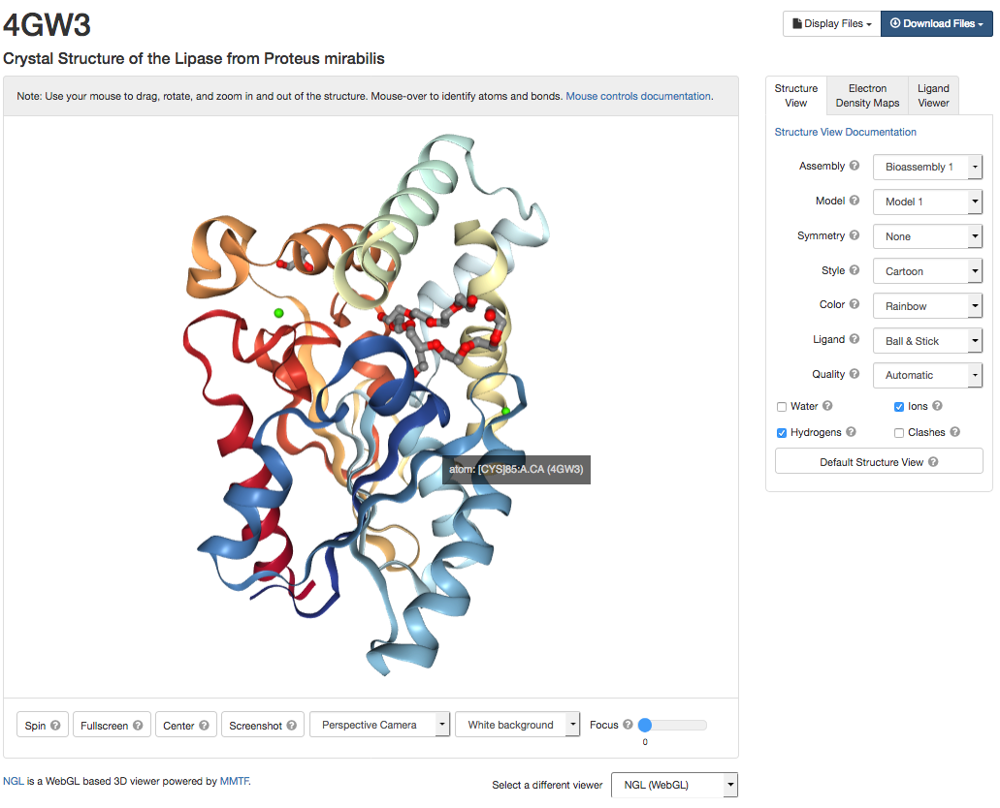
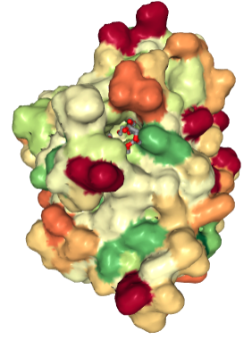
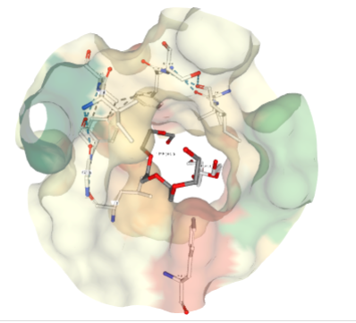

## 04-Protein structure analysis and visualisation practical
### 04-02 Visualization of PML structures using a web-based tool (NGL)
In the first practical (4-01) the sequence similarity tab in RCSB showed the sequence similarity clusters of 4GW3. These clusteres showed 4 structures that have 95% sequence identity. 

| RCSB Code  | Structure Description | 
|:------------- |:--------------- 
| 4GW3      	| PML- wild type (WT)   
| 4GXN     	| PML -WT Diethylphosphonate Inhibited                  
|4HS9			| PML Methonal tolerant mutant      
|3W9u 			| PM Lipk107         

We will concentrate on the first 3 structures, as the 4th is poorly annotated and does not have a publication associated with the RCSB entry. Hence it is more uncertain what this structure actually is.

The RCSB uses a number of web-based applications (e.g. JSmol and NGL) to allow visualization of protein structures directly from the website.

Click on the [3D View tab]( http://www.rcsb.org/pdb/explore/jmol.do?structureId=4GW3&bionumber=1) at the top of the 4GW3 entry to view the structure. By default it loads the JSmol application, but use the selection box below the structure to use NGL.
 

 
 This will load 4GW3 showing the secondary structure. 
 
 

You can use the Diplay and View Options to alter how the protein and its ligands are drawn. The colour scheme options can be used to display the surface of the protein in different ways E.g. colour by hydrophobicity.

If there are ligands or ions in the structure you can use the Interaction option to zoom in and display the binding pockets and amino acids involved in the interactions. e.g Binding pocket for PA

####Exercise 2: [10 mins]: Use the ''Display and Viewer Options'' on the right hand side to: 

1. colour 4GW3 by secondary structure 
2. show the position of calcium ions in 4GW3
3. view the surface of the protein and colour by hydrophocity
4. view the surface of the protein and colour by b-factor

#### and answer the following questions: 

1. What fold does 4GW3 have? Search the [CATH database](http://www.cathdb.info/) to help you answer this.
2. What amino acids residues are involved in binding Calcium ion CA 401?
3. What does the hydrophobicty colour scheme show you about the binding pocket where ligands PE and PA occur?
4. Each atom of protein crystal structure can have a B-factor (also known as the temperature or Debye-Waller factor ) associated with it. This essentially describes the degree to which the electron desnity is spread out. When you colour the protein surface by this factor what do you think it shows you? 
