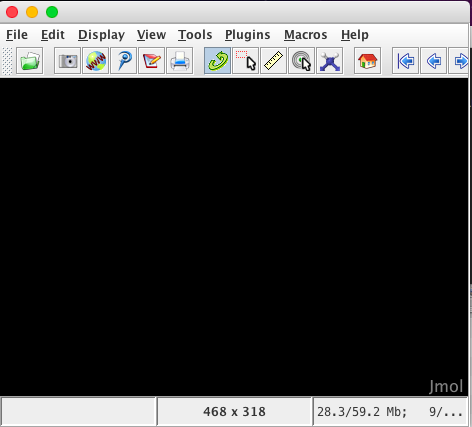
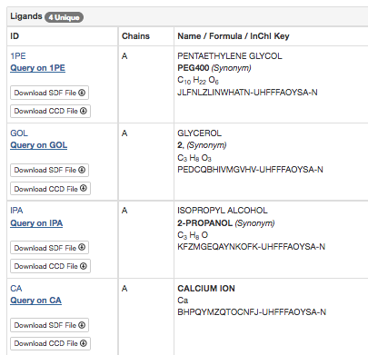
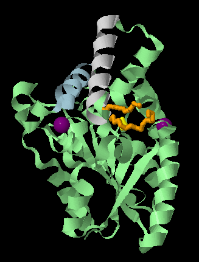
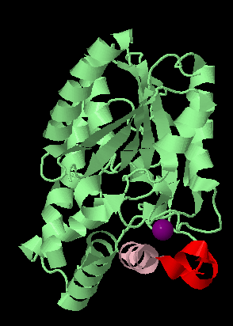
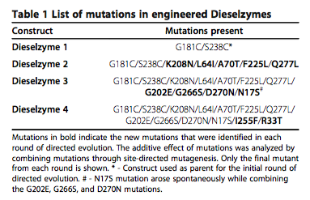

## 04-Protein structure visualization and analysis practical

### 04-03 Visualizing PM lipase structures in Jmol using scripting
So far we have used the web based viewer NGL to visualise a protein structure. But using such web based browsers is limited as we cannot carry out more complex visualizations such as 

* selecting specific atoms of interest 
* superimposing a number of different structures   
* animating structures for a presentation or demonstration
 
In this section of the practical we will view and analyse the PM lipase structures using [Jmol](http://jmol.sourceforge.net), an open source molecular viewer which allows scripting.

Jmol has 3 basic elements: the viewing window, the console and the script editor. 

* The viewing window is where the protein is rendered in 3D
*  The console is where script commands can be entered at a command-line prompt and these commands then make changes to the structure loaded in the viewing window. 
*  The script-editor is where a series of Jmol commands can be put together in script and the stript run, to makes a series of changes to the structure in the veiwing window in one go. Depending on what set-up you are using you can usually drag and drop scripts into the console and the script-editor (this should work on the sytem today)(or on some systems you can Ctrl-C and Ctrl-V). See the [Jmol wiki](http://wiki.jmol.org/index.php/Copying_and_pasting_scripts) for more details


The WT PM lipase has a number of structural features that are essential for its function. These include

1. Ca binding site: plays a role in catalysis and stability 
2. Active site pocket which has 2 lid helices a5 and a8
3. A catalytic triad

We will use Jmol scripting to analyse some of these elements to help us understand how structure is related to function.
In this pratical we will

1. load PML WT structure into Jmol
2. View the secondary structure 
3. Map the Pfam domain onto the structure
4. Identify the ligands in the structure and the two lid helices (a5(125-143) and a8 (213-224))
5. Identify the catalytic triad 
6. Identify the calcium binding site and the supporting loop region

----
####Jmol - importing, viewing, rendering, colouring
* Open a terminal window in the virtual machine (VM)
* Launch Jmol by typing

```
Jmol
```
You should see the Jmol window appear



Load the PML WT file uisng File menuu


Enter 4 digit PDB model ID : 4GW3 and the model will be automatically imported directly from the RCSB database into the Jmol viewer


The structure is automatically loaded in ball-and-stick format
and the default coloration is CPK (Corey, Pauling, Kultun), based on atom identity. 

Launch the console window from the File Menu


#####Secondary structure
In the console window type the following commands. Use a return at the end of each command to see the structure change in the Jmol main window

```
select all
ribbons
colour palegreen
```
This will change the structure in the viewing window to look like this


In the RCSB one Pfam domain was mapped to this structure covering residues 6-120, let us identify these in the structure.

```
select 6-120
colour red
```


#####Question: How does the Pfam sequence domain relate to the 3D fold of the protein?


#####Ligands
Ligands in the structure: from the RCSB Summary page we know that 4GW3 has 4 unique ligands.


We will use Jmol to highlight these ligands and the two lid helices in the structure. As this is a lot of commands to type, open the script Editor window. 


Drag and drop the commands into the Editor window and then Run the commands


```
select all
ribbons only
colour palegreen
select [IPA]
colour yellow
wireframe 150
select [1PE]
colour orange
wireframe 150
select [CA]
colour purple
spacefill
select 125-143
colour lightgrey
select 213-224
colour lightblue
spin
```

This will render your protein to look like this and spin it round, you can re-orientate the molecule in the Viewer window and then let it spin so you can see different aspects of the protein.


---


#####The catalytic triad: 
We know from the publication associated with 4GW3 [PMID:
23300806] (https://www.ncbi.nlm.nih.gov/pubmed/23300806) PML contains a hydrolase Ser-His-Asp catalytic triad with the catalytic serine (Ser79) being part of a GXSXG sequence motif. The catalytic His is residue 254 and the catalytic Asp is 232.
We will highlight the catalytic triad to see how residues that are widely spaced in the sequence are brought together in the 3D structure.

```
select all
strands only
colour palegreen
select ser79,his254,asp232
colour red
wireframe 100

```


The side chains of these catalytic residues are brought close together in the folded protein to form the active site pocket.


#####The calcium binding site
The CA binding site and support loop. One CA atom (401) is involved in the protein's function and this calcium is bound through interactions with a short loop region (that is rendered in Jmol partly loop, partly helical). This is an important site to take note of when we consider the mutated protein structure.

```
select all
cartoons only
colour palegreen
select CA401
colour purple
spacefill
select 211-224
colour pink
select 202-210
colour red
```



#####Exercise 3: [15mins] Visualization of the mutated protein. 

The PML enzyme has undergone mutagenesis to create an enzyme that is more thermo stable and has a higher methanol tolerance than the wild type. This mutated enzyme is called dieselzyme4 and its structure has been solved (PDBcode 3HS9) (Korman et al. 2013). In this exercise you will visualize the location of the muations on the structure and see how they might affect function.
The mutations are summarized here



The active mutations in dieselzyme4 occur in 3 different regions

| Region  | Mutations | 
|:------------- |:--------------- 
A|G202E,K208N,G266S
B|G181C,S238C 

Use Jmol scripting to highlight the mutation sites in the structure and see what functional sites they might be affecting.

Questions

1. What effect on the structure do the mutations have in Region A?
2. What effect on the structure do the mutations have in Region B?

